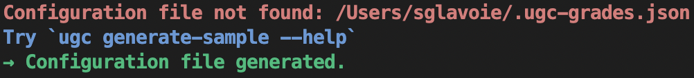

# Grades Calculator

 

This tool is all about getting information and generating insights from the progress made in a [BSc Computer Science at the University of London](https://london.ac.uk/courses/computer-science) (calculations are specific to this particular degree).

Just starting out? You're one command away from being able to get going!

Want to find out if there are any rounding issues (large or small...) with your grades? Easy!

Want to see how you are doing (academically at least)? Get an overview. \*

\* The above grades may or may not reflect actual results. Your mileage will vary.

Fancy some visual output? Show it in a single step with `ugc plot modules`!

In order to use it, please [refer to the documentation](https://uol-grades-calculator.readthedocs.io/).
