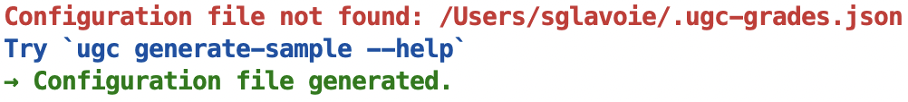

Available commands
==================

.. toctree::
   :maxdepth: 2

``check``
---------

::

    $ ugc check --help

    Usage: ugc check [OPTIONS] COMMAND [ARGS]...

    Perform sanity checks against the results generated.

    Options:
    --help  Show this message and exit.

    Commands:
    score-accuracy  Check for rounding errors when averaging module score.

``check score-accuracy``
------------------------

::

    $ ugc check score-accuracy --help

    Usage: ugc check score-accuracy [OPTIONS]

    Check for rounding errors when averaging module score.

    Options:
    --help  Show this message and exit.

Example output 1:

.. image:: ./_static/images/check_score_dark1.png
  :width: 986
  :alt: Output 1 of `ugc check score-accuracy` in dark theme

.. image:: ./_static/images/check_score_light1.png
  :width: 986
  :alt: Output 1 of `ugc check score-accuracy` in light theme

Example output 2:

.. image:: ./_static/images/check_score_dark2.png
  :width: 986
  :alt: Output 2 of `ugc check score-accuracy` in dark theme

.. image:: ./_static/images/check_score_light2.png
  :width: 986
  :alt: Output 2 of `ugc check score-accuracy` in light theme

----------

``generate-sample``
-------------------

::

    $ ugc generate-sample --help

    Usage: ugc generate-sample [OPTIONS]

    Generate a sample grades JSON config file.

    Options:
    -f, --force-overwrite  Overwrite the existing config file, if any.
    --help                 Show this message and exit.

Example output:

.. image:: ./_static/images/generate_sample_dark.png
  :width: 1002
  :alt: Default output of `ugc generate-sample` in dark theme

----------

``plot``
---------

::

    $ ugc plot --help

    Usage: ugc plot [OPTIONS] COMMAND [ARGS]...

    Plot progress made over time.

    Options:
    --help  Show this message and exit.

    Commands:
    modules  Produce a scatter plot showing all individual grades.

``plot modules``
-------------------

::

    $ ugc plot modules --help

    Usage: ugc plot modules [OPTIONS]

    Produce a scatter plot showing all individual grades.

    Options:
    -d, --dpi INTEGER RANGE  Specify the output quality in dots per inch.
                             [default: 300;100<=x<=1000]
    --filename TEXT          Change the output file name.
    --long-module-names      Display the full name of each module.
    --no-avg-overall         Remove the weighted average obtained across the
                             degree.
    --no-avg-unweighted      Remove the unweighted average per semester.
    --no-avg-weighted        Remove the weighted average per semester.
    --no-avgs                Remove all unweighted and weighted average lines.
    --no-grades              Do not display the grade for any module.
    --no-module-names        Remove the display of module names entirely.
    --no-trend               Remove the trend line.
    --path TEXT              Set the output path to save the generated plot.
    --title TEXT             Print a custom title for the graph.
    --title-keep-date        Append today's date to the title when used with
                             `--title`.
    --title-no-date          Remove the part `as of YYYY-MM-DD` in the title of
                             the graph.
    --help                   Show this message and exit.

Example output 1::

    $ ugc plot modules -d 100

    Plot saved to /home/user/Downloads/2021-08-21_grades_over_time.png

.. image:: ./_static/images/plot_output1.png
  :width: 1200
  :alt: Output of `ugc plot modules -d 100`

Example output 2::

    $ ugc plot modules --dpi 100 --filename new_name --long-module-names \
        --no-grades --path ~ --title "My custom title" --title-keep-date --no-trend

    Plot saved to /home/user/new_name.png

.. image:: ./_static/images/plot_output2.png
  :width: 1200
  :alt: Output of `ugc plot modules --dpi 100 --filename new_name --long-module-names --no-grades --path ~ --title "My custom title" --title-keep-date --no-trend`

----------

``summarize``
-------------

::

    $ ugc summarize --help

    Usage: ugc summarize [OPTIONS] COMMAND [ARGS]...

        Print a summary of the progress made so far.

    Options:
        --help  Show this message and exit.

    Commands:
        all       Output includes modules done as well as those in progress.
        done      Output includes only modules that are done and dusted.
        progress  Output includes only modules that are in progress.

Example output:

.. image:: ./_static/images/summarize_all_dark.png
  :width: 1200
  :alt: Output of `ugc summarize all` in dark theme

.. image:: ./_static/images/summarize_all_light.png
  :width: 1200
  :alt: Output of `ugc summarize all` in light theme
