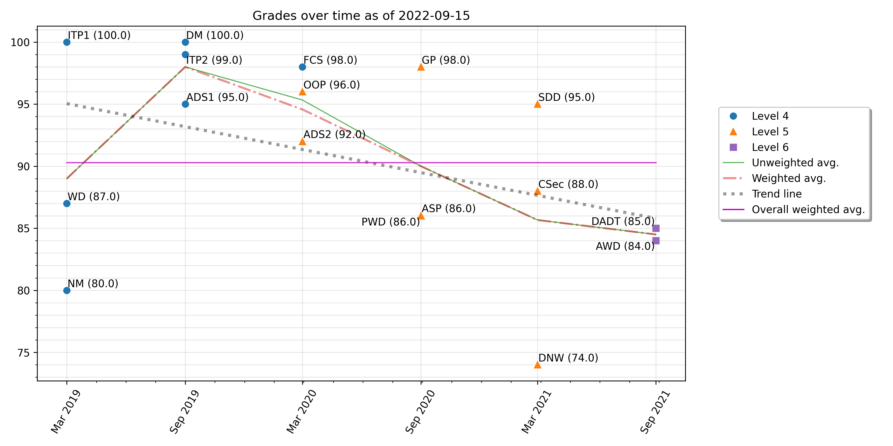

Available commands
==================

.. toctree::
   :maxdepth: 2

``check``
---------

::

    $ ugc check --help

    Usage: ugc check [OPTIONS] COMMAND [ARGS]...

    Perform sanity checks against the results generated.

    Options:
    --help  Show this message and exit.

    Commands:
    score-accuracy  Check for rounding errors when averaging module score.

``check score-accuracy``
------------------------

::

    $ ugc check score-accuracy --help

    Usage: ugc check score-accuracy [OPTIONS]

    Check for rounding errors when averaging module score.

    Options:
    --help  Show this message and exit.

Example output::

    $ ugc check score-accuracy

    Algorithms and Data Structures I: 78% actual [expected 79.0%]
    Discrete Mathematics: 79.5% actual [expected 80.0%]
    Fundamentals of Computer Science: 60% actual [expected 58.0%]

----------

``generate-sample``
-------------------

::

    $ ugc generate-sample --help

    Usage: ugc generate-sample [OPTIONS]

    Generate a sample grades JSON config file.

    Options:
    -f, --force-overwrite  Overwrite the existing config file, if any.
    --help                 Show this message and exit.

Example output::

    $ ugc generate-sample

    Configuration file not found: /home/user/.ugc-grades.json
    → Configuration file generated.

----------

``plot``
---------

::

    $ ugc plot --help

    Usage: ugc plot [OPTIONS] COMMAND [ARGS]...

    Plot progress made over time.

    Options:
    --help  Show this message and exit.

    Commands:
    modules  Produce a scatter plot showing all individual grades.

``plot modules``
-------------------

::

    $ ugc plot modules --help

    Usage: ugc plot modules [OPTIONS]

    Produce a scatter plot showing all individual grades.

    Options:
    -d, --dpi INTEGER RANGE  Specify the output quality in dots per inch.
                             [default: 300;100<=x<=1000]
    --filename TEXT          Change the output file name.
    --long-module-names      Display the full name of each module.
    --no-avg-overall         Remove the weighted average obtained across the
                             degree.
    --no-avg-unweighted      Remove the unweighted average per semester.
    --no-avg-weighted        Remove the weighted average per semester.
    --no-avgs                Remove all unweighted and weighted average lines.
    --no-grades              Do not display the grade for any module.
    --no-module-names        Remove the display of module names entirely.
    --no-trend               Remove the trend line.
    --path TEXT              Set the output path to save the generated plot.
    --title TEXT             Print a custom title for the graph.
    --title-keep-date        Append today's date to the title when used with
                             `--title`.
    --title-no-date          Remove the part `as of YYYY-MM-DD` in the title of
                             the graph.
    --help                   Show this message and exit.

Example output 1::

    $ ugc plot modules -d 100

    Plot saved to /home/user/Downloads/2021-08-21_grades_over_time.png

Example output 2::

    $ ugc plot modules --dpi 100 --filename new_name --long-module-names \
        --no-grades --path ~ --title "My custom title" --title-keep-date --no-trend

    Plot saved to /home/user/new_name.png

.. image:: ./_static/images/plot_output2.png
  :width: 1200
  :alt: Output of `ugc plot modules --dpi 100 --filename new_name --long-module-names --no-grades --path ~ --title "My custom title" --title-keep-date --no-trend`

----------

``summarize``
-------------

::

    $ ugc summarize --help

    Usage: ugc summarize [OPTIONS] COMMAND [ARGS]...

        Print a summary of the progress made so far.

    Options:
        --help  Show this message and exit.

    Commands:
        all       Output includes modules done as well as those in progress.
        done      Output includes only modules that are done and dusted.
        progress  Output includes only modules that are in progress.

    $ ugc summarize progress --help

    Usage: ugc summarize progress [OPTIONS]

    Output includes only modules that are in progress.

    In progress means there is no value provided for `module_score` yet for a
    given module.

    Options:
    -o, --avg-progress-only  Show the average for modules in progress only.
    --help                   Show this message and exit.

Example output 1::

    $ ugc summarize done

    +-------------------+---------+-----------------------------------+---------+--------+------+
    | Completion date   |   Level | Module name                       | Score   | ECTS   | US   |
    |-------------------+---------+-----------------------------------+---------+--------+------|
    | 2018-12           |       4 | How Computers Work                | N/A     | N/A    | N/A  |
    | 2019-09           |       4 | Introduction to Programming I     | 100     | A      | A    |
    | 2019-09           |       4 | Numerical Mathematics             | 80      | A      | B-   |
    | 2019-09           |       4 | Web Development                   | 87      | A      | B+   |
    | 2020-03           |       4 | Algorithms and Data Structures I  | 95      | A      | A    |
    | 2020-03           |       4 | Discrete Mathematics              | 100     | A      | A    |
    | 2020-03           |       4 | Introduction to Programming II    | 99      | A      | A    |
    | 2020-09           |       4 | Fundamentals of Computer Science  | 98      | A      | A    |
    | 2020-09           |       5 | Algorithms and Data Structures II | 92      | A      | A-   |
    | 2020-09           |       5 | Object Oriented Programming       | 96      | A      | A    |
    | 2021-03           |       5 | Agile Software Projects           | 86      | A      | B    |
    | 2021-03           |       5 | Graphics Programming              | 98      | A      | A    |
    | 2021-03           |       5 | Programming with Data             | 86      | A      | B    |
    +-------------------+---------+-----------------------------------+---------+--------+------+

    Weighted average: 92.41 (ECTS: A, US: A-)
    Unweighted average: 93.08 (ECTS: A, US: A)
    Classification (weighted): First Class Honours
    GPA (weighted): 3.7 US – 4 UK
    Total credits done: 195 / 360 (54.17%)

Example output 2::

    $ ugc summarize progress

    +---------------------------------+---------+-----------+--------+------+
    | Module name                     |   Level |   Midterm | ECTS   | US   |
    |---------------------------------+---------+-----------+--------+------|
    | Computer Security               |       5 |       100 | A      | A    |
    | Databases Networks and the Web  |       5 |        90 | A      | A-   |
    | Software Design and Development |       5 |        88 | A      | B+   |
    +---------------------------------+---------+-----------+--------+------+

    Weighted average (including modules in progress): 92.48 (ECTS: A, US: A-)
    Unweighted average (including modules in progress): 93.0 (ECTS: A, US: A)
